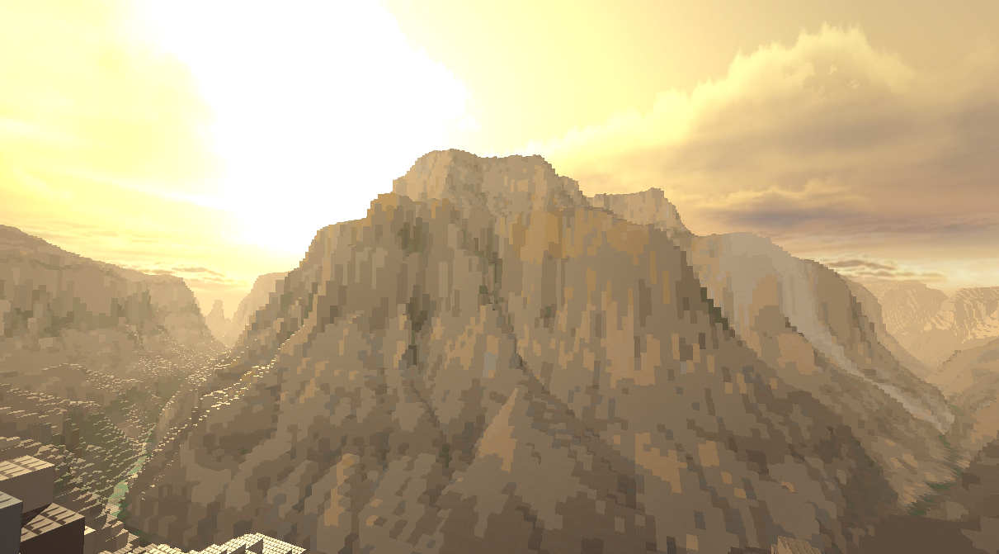

# heightmap2bls
A CLI tool for generating blockland save files (.bls) from greyscale height maps and color maps.




## Setup

You need Python to run this program.

Git clone the repo or download it as a zip and extract it.

Before using, you must install the dependencies (numpy and pillow):

#### Windows
From the root directory of the project (you should be in the folder that contains "requirements.txt"), run this command in cmd.exe (or any other terminal):
```bash
python -m pip install -r requirements.txt
```

#### Linux/MacOS
From the root directory of the project (you should be in the folder that contains "requirements.txt"), run this command in your terminal of choice:
```bash
pip install -r requirements.txt
```

## Usage

### GUI

***IMPORTANT*** -> If you have previously used the software, delete all files, download the latest version & follow the setup steps again! There are new requirements.

The GUI is currently just a prototype and is not extensively tested, but it should make creating maps a bit less of a hassle!


#### Windows:
If your python is set up to automatically recognize .py files, simply double click main.py.
If not, you can also run
```bash
python main.py
```
#### Linux/MacOS:
```bash
python3 main.py
```

### CLI

#### Windows:
```bash
python hm2bls.py -hm [path/to/a/height/map.png]
```

#### Linux/MacOS:
```bash
python3 hm2bls.py -hm [path/to/a/height/map.png]
```

#### Parameters and options:

```bash
usage: hm2bls [-h] -hm HEIGHTMAP [-cm COLORMAP] [-cs COLORSET] [-o OUTPUT] [-x X] [-y Y] [-z Z] [--blid BLID] [--ground] [--gapfill] [--optimize] [--bricks BRICKS] [--step STEP]

Generate Blockland save files from 8-bit Heightmaps!

options:
  -h, --help            show this help message and exit
  -hm HEIGHTMAP, --heightmap HEIGHTMAP
                        path to the heightmap
  -cm COLORMAP, --colormap COLORMAP
                        path to the color map
  -cs COLORSET, --colorset COLORSET
                        path to the colorset
  -o OUTPUT, --output OUTPUT
                        output filepath
  -x X                  define x axis size
  -y Y                  define y axis size
  -z Z                  define z axis size
  --blid BLID           save the map with a custom BL_ID.
  --ground              sit the map on the ground
  --gapfill             fill vertical gaps
  --optimize            attempts to optimize the brickcount by using the second brick from a file
  --bricks BRICKS       select the file that defines which bricks to use
  --step STEP           define the vertical step of the map (1 = plate, 3 = brick)
```

## Height maps

A height map MUST be specified for the program to run by either using the -hm or --heightmap parameters.

```bash
python hm2bls.py -hm example.png
```

Height maps must be in grey scale and use 8-bit RGBA color depth.
The program will attempt to convert jpegs to use RGBA by default, but certain images will need to be manually re-exported as 8-bit RGBA .png files.

## Color maps

A custom color map can be used to attempt to color in the map with the -cm or --colormap parameters.

```bash
python hm2bls.py -hm example.png -cm example_color_map.png
```

Color maps can be any png or jpeg file, but ideally choose one that uses 8-bit RGBA color depth and that's the same size as the height map (not strictly necessary as both the heightmap and colormap will be scaled to the -x -y and -z parameters).

## Colorsets

By default, the program will map the color map's colors to Blockland's default colorset, unless provided a custom colorset to use with the -cs or --colorset parameters.

```bash
python hm2bls.py -hm example.png -cs custom_color_set.txt
```

The color mapping may work better depending on what colorset is used and what colors the color map contains.

## Naming outputs and Hotswapping generated saves

Outputs will by default be placed into the "out/" folder and be called map.bls unless the --output parameter is used.

```bash
python hm2bls.py -hm example.png --output my_cool_map.bls
```

It is possible to hotswap a save file in blockland, provided the game is started with the .bls file already in its' "saves/" folder.
To do this, i recommend that you use the --output parameter and set it to your games' saves location, for example:

```bash
python hm2bls.py -hm example.png --output "C:/Program Files (x86)/Steam/steamapps/common/Blockland/saves/map.bls"
```

By doing this, it will overwrite the map.bls save file, allowing you to reload it in game without having to restart. (This should make iterating with parameters a lot quicker).

## Map scaling

Maps will by default be generated at the size of the height map, in which case, the color map should be the same size as the height map, however, it is possible to generate a map at any desired size using the -x, -y and -z parameters (where the x axis refers to image height, y axis to image width and z axis refers to the height in plates of the generated output).

```bash
python hm2bls.py -hm example.png -x 100 -y 250 -z 320
```

## Height steps

The variation in height can be mapped to a fixed interval (in case you want the difference in height to match that of a brick instead of a plate) by using the --step parameter.

```bash
python hm2bls.py -hm example.png --step 3
```

## Optional flags

### Gap filling

If the generated map has vertical gaps between bricks, you can use the --gapfill flag to fill them.

```bash
python hm2bls.py -hm example.png --gapfill
```

### Brick Optimization

If the save file contains too many bricks, at the cost of generation time the program can attempt to use larger bricks (defined in the brick file) to optimize the map in areas where the color and height is the same as adjacent bricks.
To use brick optimization, use the --optimize flag.

```bash
python hm2bls.py -hm example.png --optimize
```

In its' current state, this is imperfect and will probably result in some unfilled gaps if using the --gapfill flag.

### Grounding

If the save is generated high up in the air, you can use the --ground flag to guarantee that the lowest part of the map touches the ground.

```bash
python hm2bls.py -hm example.png --ground
```

## Brick files:

The program currently comes with two brick files, one that uses default bricks that requires no addons (1x1x5, 2x2x5 bricks) and one that requires the [miniterrain bricks addon](https://cdn.discordapp.com/attachments/525811965398876160/1055599397880201246/Brick_4n8brickH.zip?ex=67765dcc&is=67750c4c&hm=2faa96e7b56fe64d7638e380e1d385a6d0cc88e5f749c63d2f2e8854de5e2214&) (Brick_4n8brickH.zip) by Goldtits.
This or any other custom brick file can be used with the --bricks parameter.

```bash
python hm2bls.py -hm example.png --bricks res/terrainBricks.json
```

You can define a custom set of bricks to use for generating saves.
Copy the brickTemplate.json file in the res folder and put in the details of the bricks you want to use.

The first brick defined will be considered the smaller of the two bricks. The second should ideally be twice and wide and long, but the same height as the first brick. 

Refer to the provided terrainBricks.json and defaultBricks.json files for more info.

(This may be changed in the future.)

## Long generation times

Generation times have been greatly improved in the latest version.
For greater brick efficiency, consider using the terrainTall.json brickfile and Bricks_4n8brickT.zip addon located in the res/ folder.